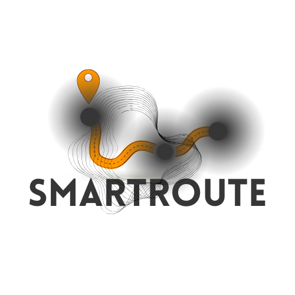

# SmartRoute - Real-Time Intelligent Route Optimization Platform for Marrakech

<p align="center">
  <a href="https://SmartRoute.com" target="_blank" rel="noreferrer">
    
  </a>
</p>


## Overview
SmartRoute is a web-based application designed to optimize urban mobility in Marrakech by providing real-time route planning using artificial intelligence. The platform leverages advanced machine learning models (XGBoost and Random Forest) and graph algorithms (Dijkstra and A*) to deliver efficient, traffic-aware routes tailored to user preferences. Built with a modular architecture, it integrates a frontend (Angular), backend (Spring Boot + PostgreSQL), and an AI module (Flask + Python), ensuring scalability, security, and an intuitive user experience.

This project was developed as part of the Computer Engineering program at the École Nationale des Sciences Appliquées (ENSA) Marrakech during the 2024/2025 academic year.

## Features
- **Real-Time Route Optimization**: Calculates optimal routes using Dijkstra and A* algorithms, factoring in real-time traffic and weather conditions.
- **Traffic and Travel Time Prediction**: Utilizes XGBoost for travel time estimation and Random Forest for traffic volume prediction, based on data such as distance, weather, and historical traffic patterns.
- **Interactive User Interface**: Built with Angular and Leaflet for a responsive, map-based experience with features like geolocation, route visualization, and user profile management.
- **Secure Authentication**: Implements JWT and OAuth2 (Google, GitHub) for secure user authentication and data protection, compliant with GDPR standards.
- **Real-Time Notifications**: Alerts users to sudden changes in traffic conditions, such as accidents or roadworks.
- **Trip History and Preferences**: Allows users to save preferences and view past trips for personalized navigation.

## Project Structure
The project is organized into three main layers:
1. **Frontend (Angular)**:
   - Built with Angular 17, Angular Material, Leaflet, and RxJS.
   - Handles user interactions, map visualization, and API communication.
   - Key components: `NavbarComponent`, `MapComponent`, `RouteFormComponent`, `RouteDetailsComponent`.
2. **Backend (Spring Boot + PostgreSQL)**:
   - Developed with Spring Boot, Spring Security, and Spring Data JPA.
   - Manages user authentication (JWT, OAuth2), API endpoints, and data persistence.
   - Uses PostgreSQL for reliable and scalable data storage.
3. **AI Module (Flask + Python)**:
   - Powered by Flask, XGBoost, Random Forest, and OSMnx.
   - Handles route calculations and traffic predictions using data from OpenStreetMap and OpenWeatherAPI.
   - Hosted models on Hugging Face for dynamic retrieval.

## Installation
### Prerequisites
- Node.js (v16 or higher) for Angular
- Java 17 and Maven for Spring Boot
- Python 3.8+ for Flask
- PostgreSQL 13+
- Git for version control
- Docker (optional, for containerized deployment)

### Setup
1. **Clone the Repository**:
   ```bash
   git clone https://github.com/OthmaneAbder2303/SmartRoute.git
   cd smartroute

2. **Frontend Setup**:
   ```bash
   cd frontend
   npm install
   npm start
   ```
   The Angular app will run on http://localhost:4200.


3. **Backend Setup**:
   ```bash
   cd backend
   mvn clean install
   mvn spring-boot:run
   ```
  The Spring Boot server will run on http://localhost:8080.


4. **AI Module Setup**:
   ```bash
   cd ai-module
   pip install -r requirements.txt
   python app.py
   ```
  The Flask server will run on http://localhost:5000.


4. **Database Configuration**:
  Create a PostgreSQL database named smartroute.
  Update the application.properties file in the backend directory with your database credentials:
   ```properties
   spring.datasource.url=jdbc:postgresql://localhost:5432/smartroute
   spring.datasource.username=your-username
   spring.datasource.password=your-password
   ```

5. **Environment Variables**:
  For the AI module, set up environment variables for OpenWeatherAPI and Hugging Face API keys.
  For the OAuth2, set up environment variables for google client id and github.


6. **Run the Application**:
  Ensure all three components (frontend, backend, AI module) are running.
  Access the application at http://localhost:4200.


### Future Improvements
Public Transport Integration: Include bus and taxi routes with schedules.
Collaborative Features: Allow users to report real-time incidents (e.g., accidents, roadworks).
Advanced AI: Explore deep learning models (e.g., RNNs) for long-term traffic predictions.
Accessibility: Add support for users with disabilities, such as wheelchair-friendly routes or voice navigation.
